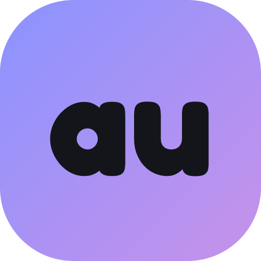

<div align="center">



# Autonym

**AI roleplay & story-writing, without the technical mess.**

A structured, compendium-first desktop app for solo roleplayers and authors, built on
[OpenRouter](https://openrouter.ai). MIT licensed.

### 🔗 [**autonym.app**](https://autonym.app) — features, screenshots, and the Windows download

[](LICENSE)
[](https://autonym.app)

</div>

---

Everything you'd want to know as a *user* — what Autonym does, how the Crew/Universes/Records/
Journeys/Beacons systems fit together, and where to download it — lives at **[autonym.app](https://autonym.app)**.
This README covers running the source and contributing.

## Running from source

```bash
npm install
npm run dev
```

On first launch, go to **Settings** and paste an OpenRouter API key (get one at
[openrouter.ai/keys](https://openrouter.ai/keys)) — it's encrypted at rest via OS-level credential
encryption and never leaves the Electron main process.

## Building a Windows installer

```bash
npm run build:win
```

Output lands in `dist/`.

## Testing

```bash
npm run typecheck
npm test
```

## Architecture notes

- All OpenRouter API calls and the API key live only in the Electron **main** process
  (`src/main/openrouter.ts`); the renderer talks to it over IPC (`src/preload/index.ts`) and never
  sees the key or makes network calls directly.
- Data is stored as a single JSON file in the app's userData folder (`src/main/db.ts`) — simple and
  dependency-free for a personal-scale app; no native compilation required.
- `src/shared/assemble.ts` is the only place that turns structured character/persona/lorebook/mood
  fields into the actual prompt sent to the model.
- `src/shared/characterInheritance.ts` resolves a linked character variant's blank fields against
  its base character before assembly, so downstream consumers never need to know Universes exist.
- Purely clerical, non-creative tasks (wiki/text structuring, thesaurus lookups, journal
  summaries) are hardcoded to a fixed, hidden model (`CLERICAL_MODEL_ID` in
  `src/shared/presets.ts`) rather than using the Act's chosen model — quality on those tasks
  shouldn't depend on what the user picked for creative writing.
- The marketing/landing page in `docs/` is a static site served via GitHub Pages at
  [autonym.app](https://autonym.app) (see `docs/CNAME`) — it's independent of the app itself and
  can be edited without touching `src/`.

## License

MIT — see [LICENSE](LICENSE).
